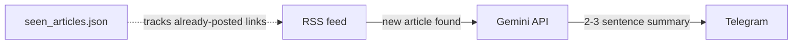

# ai-news-summarizer-bot

AI-powered bot that watches a crypto/web3 news RSS feed, summarizes new articles with Google's free Gemini API, and posts the summaries straight to a Telegram channel — no manual curation needed.

## How it works



1. Every 15 minutes, the script checks the RSS feed for new articles.
2. Each new article's title + description is sent to Gemini for a short summary.
3. The summary, title, and a link to the original article are posted to Telegram.
4. Already-posted articles are tracked locally so nothing gets sent twice.

## Setup

1. Create a Telegram bot via [@BotFather](https://t.me/BotFather) and get a `BOT_TOKEN`.
2. Message your bot once, then open `https://api.telegram.org/bot<TOKEN>/getUpdates` to find your `CHAT_ID`.
3. Get a free Gemini API key at [aistudio.google.com/apikey](https://aistudio.google.com/apikey).
4. Fill in `BOT_TOKEN`, `CHAT_ID`, and `GEMINI_API_KEY` at the top of `news_bot.py` (or set them as environment variables).

## Usage

```bash
pip install -r requirements.txt
python news_bot.py
```

The script runs in an endless loop, checking the feed every 15 minutes. Stop it with `Ctrl+C`.

## Sample output

A real message posted by the bot:


## Notes

- The default feed is CoinDesk's crypto news RSS, but `RSS_FEED_URL` in the config works with any RSS feed — not just crypto.
- Posting directly to X/Twitter requires a paid developer API plan, so this bot targets Telegram, which is free. The `send_to_telegram()` function can be adapted to another destination if needed.
